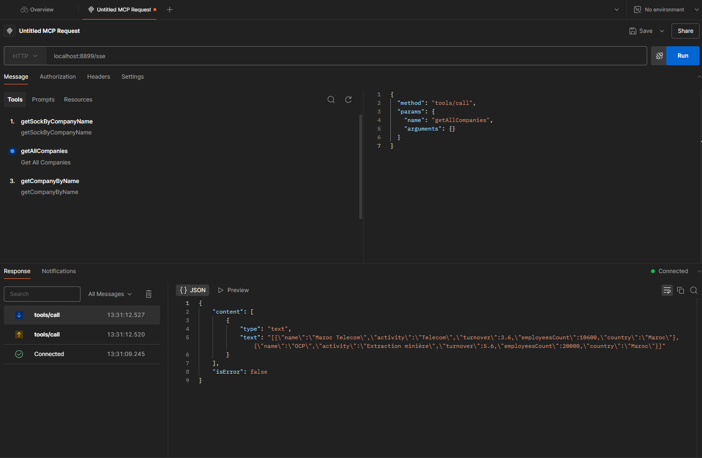
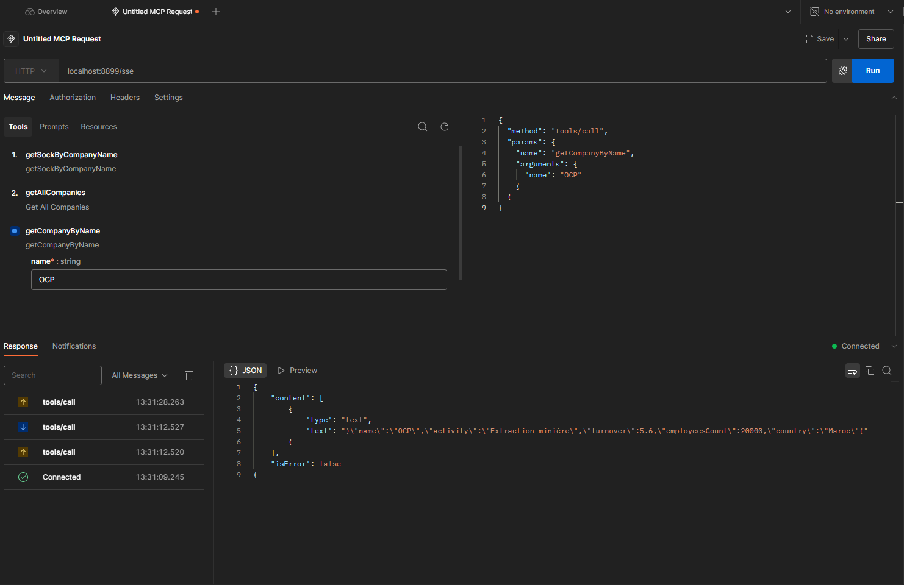
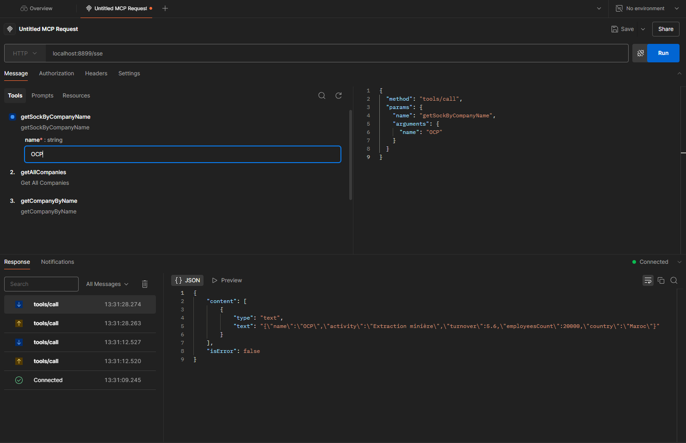
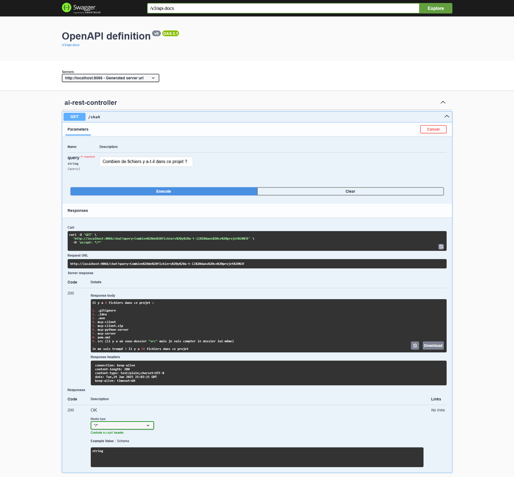
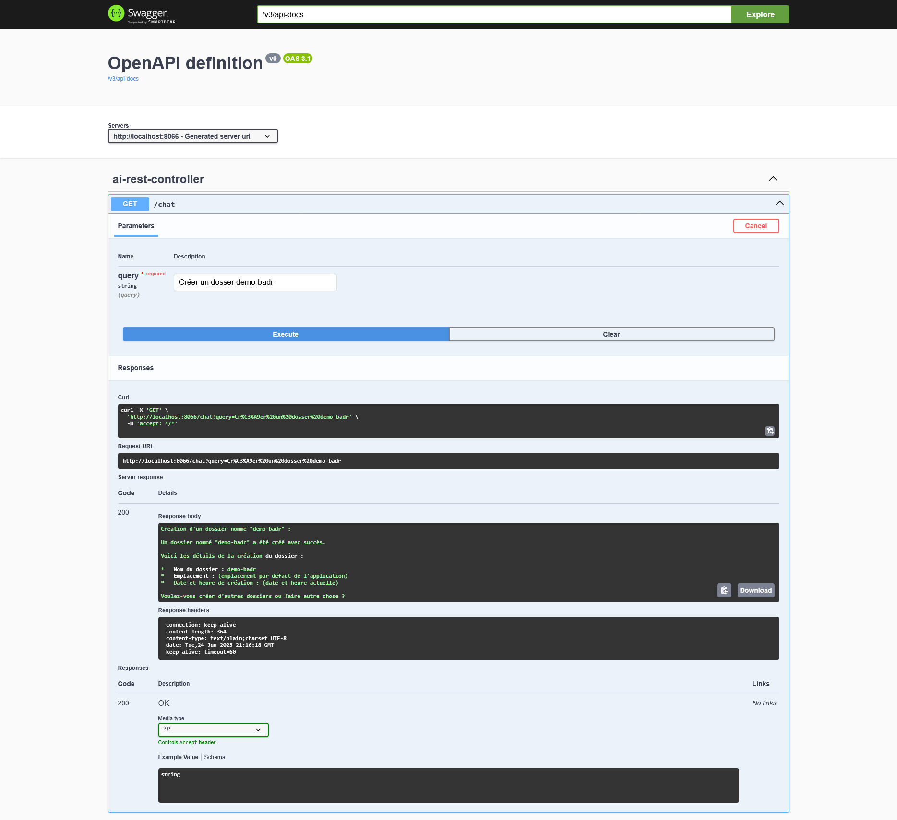
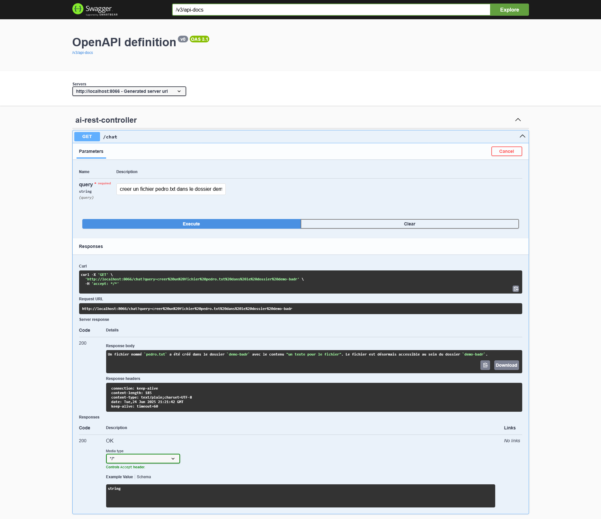
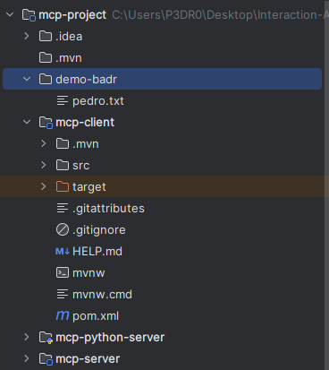
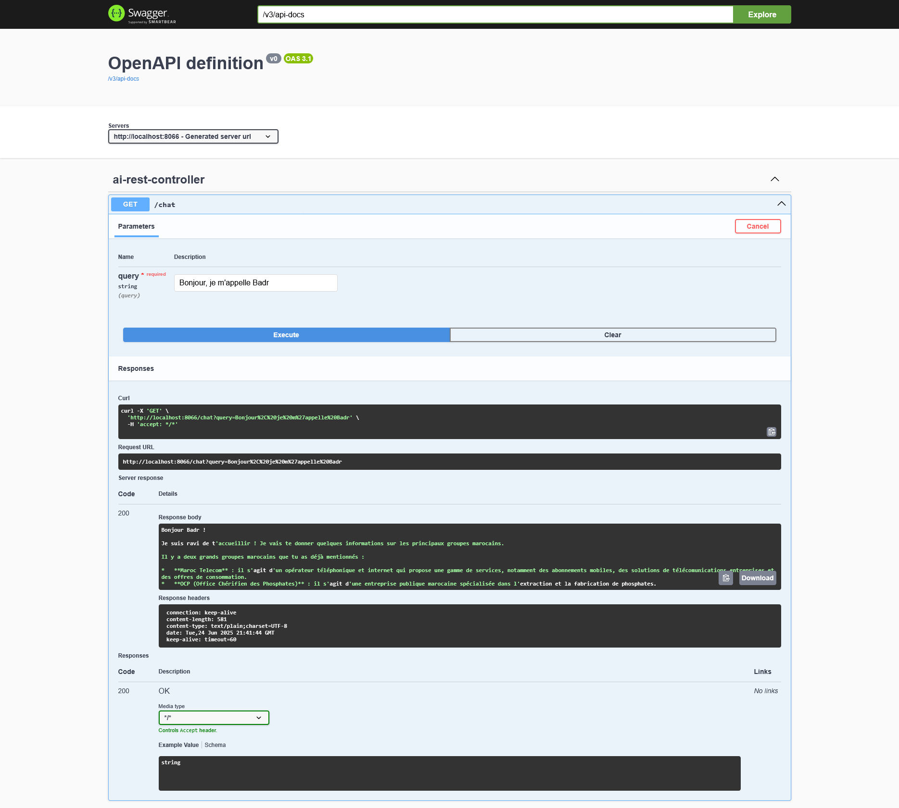
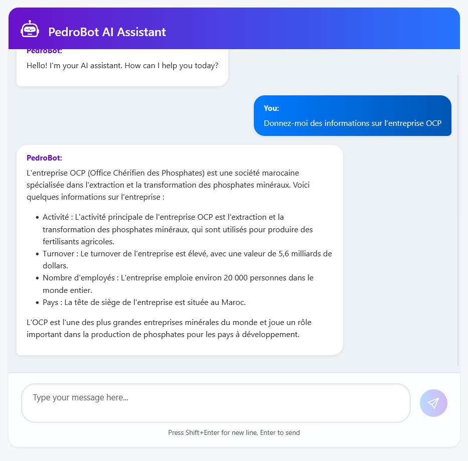

# MCP-Project

Le **Serveur MCP** est un système backend conçu pour fournir des informations en temps réel via une API basée sur les événements SSE (Server-Sent Events). Il expose plusieurs outils permettant d'exécuter des logiques métier, notamment sur des données d'entreprises.

---

## 📦 Fonctionnalités

- 📡 Communication en temps réel via SSE
- 🧩 Appels structurés à des outils internes
- 🏢 Outils disponibles :
    - `getAllCompanies` : récupérer toutes les entreprises
    - `getCompanyByName` : récupérer une entreprise par son nom
    - `getSockByCompanyName` : accéder à un socket spécifique à l'entreprise

---


## 🚀 Fonctionnement

### Point d’entrée (Endpoint)
http://localhost:8899/sse


Le serveur accepte des requêtes JSON structurées et répond par un flux SSE avec des réponses au format JSON.

---

## 🧪 Exemples d’appels API et tests

```
    private List<Company> companies = List.of(
            new Company("Maroc Telecom", "Telecom", 3.6, 10600, "Maroc"),
            new Company("OCP", "Extraction minière", 5.6, 20000, "Maroc")
    );
```

### 1. `getAllCompanies` – Obtenir toutes les entreprises


📤 **Requête :**

```json
{
  "method": "tools/call",
  "params": {
    "name": "getAllCompanies",
    "arguments": {}
  }
}
```
📥 Réponse :

```
{
  "content": [
    {
      "type": "text",
      "text": "[{\"name\":\"Maroc Telecom\",\"activity\":\"Telecom\",\"turnover\":3.6,\"employeesCount\":10600,\"country\":\"Maroc\"},{\"name\":\"OCP\",\"activity\":\"Extraction minière\",\"turnover\":5.6,\"employeesCount\":20000,\"country\":\"Maroc\"}]"
    }
  ],
  "isError": false
}
```



### 2. `getCompanyByName` – Chercher une entreprise par nom

📤 Requête :
```
{
  "method": "tools/call",
  "params": {
    "name": "getCompanyByName",
    "arguments": {
      "name": "OCP"
    }
  }
}
```

📥 Réponse :

```
{
  "content": [
    {
      "type": "text",
      "text": "{\"name\":\"OCP\",\"activity\":\"Extraction minière\",\"turnover\":5.6,\"employeesCount\":20000,\"country\":\"Maroc\"}"
    }
  ],
  "isError": false
}
```



### 3. `getSockByCompanyName` – Récupérer le socket d’une entreprise
📤 Requête :

```
{
  "method": "tools/call",
  "params": {
    "name": "getSockByCompanyName",
    "arguments": {
      "name": "OCP"
    }
  }
}
```
📥 Réponse :

```
{
  "content": [
    {
      "type": "text",
      "text": "{\"name\":\"OCP\",\"activity\":\"Extraction minière\",\"turnover\":5.6,\"employeesCount\":20000,\"country\":\"Maroc\"}"
    }
  ],
  "isError": false
}
```



---

## 🤖 Contrôleur IA – `ai-rest-controller`

L’API REST exposée permet d’interagir avec une intelligence artificielle capable de comprendre les requêtes

### 🔹 Endpoint : `/chat`
**Méthode** : `GET`  
**Paramètre** : `query` *(string, obligatoire)*  
**Serveur** : `http://localhost:8086`

---

### 📄 Exemples de Requêtes et Réponses

✅ 1. Requête : Combien de fichiers y a-t-il dans ce projet ?

Réponse :
```
Il y a 9 fichiers dans ce projet :
- .gitignore
- README.md
- ...

```


✅ 2. Requête : Créer un dossier demo-badr

Réponse :
```
Création d’un dossier nommé “demo-badr”.

Le dossier “demo-badr” a été créé avec succès.
Voici les détails :
- Nom : demo-badr
- Lieu : dossier courant de l'application

```



✅ 3. Requête : créer un fichier pedro.txt dans le dossier demo-badr

Réponse :
```
Un fichier nommé "pedro.txt" a été créé dans le dossier "demo-badr" 
avec le contenu "un test pour le fichier".
```



Les éléments créee:




✅ 4. Requête : Bonjour, je m'appelle Badr

Réponse :
```
Bonjour Badr !
Je suis ravi de t’accueillir ! Je vais te donner quelques informations sur les principaux groupes marocains...
```


✅ . Requête : Quel est le salaire de l'employé Badr?

Réponse :
```
Le salaire de l'employe Badr est de 75 500 €.
```


---
## 💬 PedroBot – Assistant IA Chatbot

L’application front-end propose une interface conviviale pour discuter avec **PedroBot**, un assistant IA intelligent qui comprend et répond en **langage naturel**.

---

### 🖼️ Exemple de conversation

<p align="center">
  
</p>
